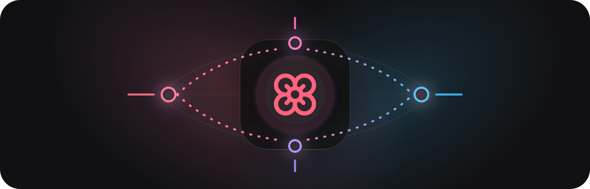

<p align="center">
  
</p>

<h1 align="center">Remote Kanna</h1>

<p align="center">
  <strong>A remote-first fork of Kanna for running Codex and terminals across SSH/Tailscale machines.</strong>
</p>

<p align="center">
  <a href="https://github.com/jakemor/kanna"></a>
  
  
</p>

<br />

<p align="center">
  <picture>
    
  </picture>
</p>

<br />

## Why This Fork Exists

Remote Kanna keeps Kanna's clean chat UI, project sidebar, transcript rendering, and Codex support, then adds a central-machine workflow:

```text
browser -> Remote Kanna server -> SSH/Tailscale -> remote machine -> Codex / terminal
```

Use it when one always-on server should control coding sessions on several machines, while each machine keeps its own projects, terminals, and general chats.

## Features

- **Remote project indexing** — discover projects from configured SSH machines.
- **Per-machine General Chat** — each configured host gets its own General Chat space.
- **Remote Codex sessions** — launch `codex app-server` on the selected machine and resume older Codex sessions where available.
- **Embedded remote terminals** — open terminals through SSH, including Windows `cmd.exe` terminals with real TTY behavior.
- **Tailscale-friendly targets** — use direct SSH targets such as `dev@100.64.0.10`.
- **Project-first sidebar** — chats are grouped by project and by machine.
- **Local-first storage** — event logs and snapshots stay on the Kanna server.
- **Upstream Kanna UI base** — this fork is based on [jakemor/kanna](https://github.com/jakemor/kanna).

## Quickstart

```bash
git clone https://github.com/ysnock404/remote-kanna.git
cd remote-kanna
bun install
bun run build
bun install -g .
```

Run on the central machine:

```bash
kanna --remote --no-open
```

Default URL:

```text
http://localhost:3210
```

## Remote Hosts

Configure remote hosts in the active settings file, normally:

```text
~/.kanna/data/settings.json
```

Example:

```json
{
  "remoteHosts": [
    {
      "id": "lab",
      "label": "Lab Workstation",
      "sshTarget": "dev@100.64.0.10",
      "enabled": true,
      "projectRoots": ["~/Projects", "~/work"],
      "codexEnabled": true,
      "claudeEnabled": false
    },
    {
      "id": "desktop-pc",
      "label": "Windows Host",
      "sshTarget": "dev@100.64.0.20",
      "enabled": true,
      "projectRoots": ["/c/Users/dev/Projects"],
      "codexEnabled": true,
      "claudeEnabled": false,
      "terminalShell": "cmd"
    }
  ]
}
```

Use `terminalShell: "cmd"` for Windows OpenSSH hosts that should open embedded terminals in `cmd.exe`.

More detail: [docs/remote-hosts.md](docs/remote-hosts.md)

## Requirements

Central machine:

- Bun `1.3.5+`
- SSH access to each remote machine
- The Remote Kanna server process running in build or dev mode

Each remote machine:

- SSH reachable from the central machine
- `codex` installed and authenticated for Codex sessions
- `node` available for discovery helpers
- `git`
- Project directories present on disk

SSH auth must be non-interactive. Use SSH keys or Tailscale SSH; password prompts are blocked by `BatchMode=yes`.

## Architecture

```text
Browser (React)
    <-> WebSocket
Remote Kanna Server (Bun)
    -> EventStore / ReadModels / WSRouter
    -> local Codex app-server, local terminal, local files
    -> SSH remote host
         -> remote Codex app-server
         -> remote terminal
         -> remote project discovery
```

State is stored locally at `~/.kanna/data/` using append-only JSONL logs plus compacted snapshots.

## Upstream Base

This fork tracks the public Kanna project and keeps its original icon and core presentation style.

- Upstream: [jakemor/kanna](https://github.com/jakemor/kanna)
- Upstream base commit: `17ccafca8af2436067b08630bacfcf915ec83a8b`

Keep this commit around when rebasing or pulling newer Kanna changes into this fork.

## Development

```bash
bun install
bun run dev
```

Useful checks:

```bash
bun run check
bun test
```

## Current Limits

- Remote Claude is not wired yet. The current Claude SDK runtime runs local to the Kanna server process.
- SSH hosts need non-interactive auth.
- Some desktop/open-file integrations may still depend on the host platform.

## Public Repo Safety

Do not commit real hostnames, usernames, Tailscale IPs, API keys, tokens, passwords, or private project paths. Keep machine-specific configuration in local settings only.

## License

[MIT](LICENSE)
